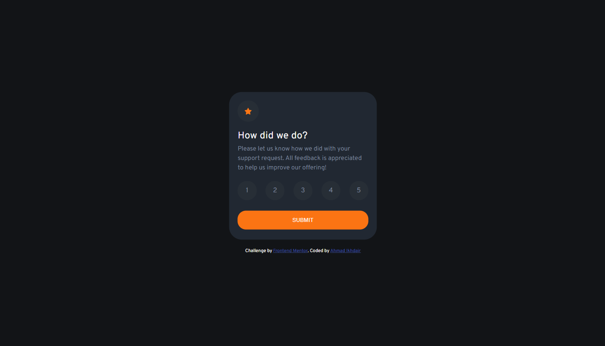

# Frontend Mentor - Interactive rating component solution

This is a solution to the [Interactive rating component challenge on Frontend Mentor](https://www.frontendmentor.io/challenges/interactive-rating-component-koxpeBUmI). Frontend Mentor challenges help you improve your coding skills by building realistic projects. 

## Table of contents

- [Overview](#overview)
  - [The challenge](#the-challenge)
  - [Screenshot](#screenshot)
  - [Links](#links)
- [My process](#my-process)
  - [Built with](#built-with)
  - [What I learned](#what-i-learned)
  - [Continued development](#continued-development)
- [Author](#author)

**Note: Delete this note and update the table of contents based on what sections you keep.**

## Overview

### The challenge

Users should be able to:

- View the optimal layout for the app depending on their device's screen size
- See hover states for all interactive elements on the page
- Select and submit a number rating
- See the "Thank you" card state after submitting a rating

### Screenshot

### Links

- Solution URL:  [Solution](https://www.frontendmentor.io/solutions/interactive-rating-component-Pn5U-bgqI6)
- Live Site URL:  [Live site](https://ahmadikhdair.github.io/Interactive-rating-component/)

## My process

### Built with

- Semantic HTML5 markup
- CSS custom properties
- Flexbox
- Javascript (jQuery)

### What I learned

Focused most on the javascript section of this project. Made sure to include an error to if a user submits without choosing a rating. Gave the user the option to click on his selected choice to cancel it. Tried my best to make the code as error free as possible!

### Continued development

Much more to learn with javascript, looking forward to learning how to be more effecient when programmingand making sure bugs do not exist.

## Author

- Website - [Ahmad Ikhdair](https://github.com/AhmadIkhdair)
- Frontend Mentor - [@AhmadIkhdair](https://www.frontendmentor.io/profile/AhmadIkhdair)

